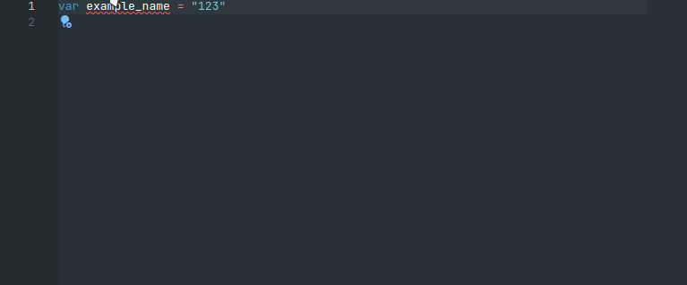

# Do not use snake_case, use camelCase (`vnva/no-snake-case-identifiers`)

🔧 This rule is automatically fixable by the [`--fix` CLI option](https://eslint.org/docs/latest/user-guide/command-line-interface#--fix).

## Fixing example



## Rule Details

Examples of **incorrect** code for this rule:

```js
var example_name = "123";
```

Examples of **correct** code for this rule:

```js
var exampleName = "123";
```
